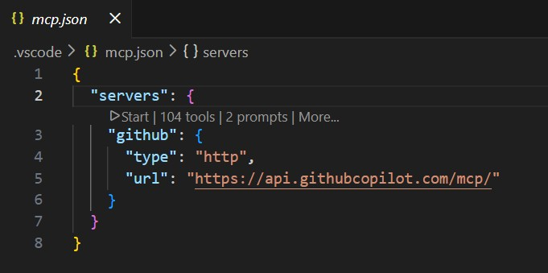

### 🚀 Benefits of MCP
Model Context Protocol (MCP) enables advanced AI-powered features in your development workflow. Key benefits include:
- **Chat Agent Automation:** The Chat Agent can automatically create, update, and manage GitHub issues, streamlining project management and reducing manual effort.
- **Cross-Repository Search:** MCP allows the Chat Agent to search and reference other repositories, making it easier to gather information, reuse code, and maintain consistency across projects.
- **Enhanced Collaboration:** By integrating MCP, your team can leverage AI to automate repetitive tasks, improve code quality, and accelerate development cycles.

Good skills lesson to take

https://github.com/skills/integrate-mcp-with-copilot/

Closed Issue that describes skill lesson
https://github.com/npr99/pypdfcodebook/issues/14

### Start MCP server
- Goto the file  `.vscode\mcp.json`
- Click the Start button

### Test MCP Server is working
Start a new chat in Agent Mode

Example prompt to check that MCP is working

'''sh
Summarize an open issue.
'''

