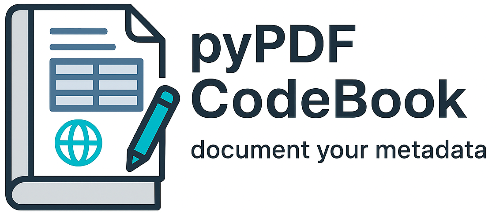

[](https://badge.fury.io/py/pypdfcodebook)
[](https://pypi.org/project/pypdfcodebook/)
[](https://opensource.org/licenses/MPL-2.0)
[](https://doi.org/10.5281/zenodo.17956282)



# pypdfcodebook

pyPDFCodeBook helps researchers and data professionals create clear, attractive codebooks for tabular datasets. Codebooks document essential metadata—project descriptions, data provenance, variable definitions, and summaries—ensuring your data is understandable and reproducible. While datasets contain values, they rarely explain what each column or row represents. Codebooks fill this gap by providing structured, self-explanatory documentation. They reinforce best practices such as tidy data, unique keys, and transparent variable origins. With pyPDFCodeBook, generating a professional, easy-to-read codebook takes just a few clicks—laying the foundation for good data science and reproducible research. 

**Remember: You are your number one data user, so help your future self out and document your metadata.**

## 🚀 Features

- **Professional PDF Generation**: Create polished, publication-ready codebooks
- **Comprehensive Metadata**: Include project descriptions, data source information, and variable definitions

## 📦 Installation

Install pypdfcodebook from PyPI using pip:

```bash
pip install pypdfcodebook
```

## 🔧 Quick Start

Here's a simple example to get you started:

```python
from pypdfcodebook.pdfcb_03c_codebook import codebook

# Simple approach: Use CSV filename and let codebook load the data
cb = codebook(
    input_csv_filename='your_data.csv',  # CSV file to load
    input_dir='./data/',  # Directory containing your files
    datastructure_filename='data_structure.py',  # Optional: your data structure file
    projectoverview_filename='overview.md',  # Optional: project description
    keyterms_filename='terms.md',  # Optional: key terms
    output_filename='my_codebook'
    # Codebook automatically creates output folder and handles all path building
)

# Generate the PDF codebook
cb.create_codebook()
```

**Alternative: Use DataFrame directly**

```python
import pandas as pd

# Load your data manually
data = pd.read_csv('your_data.csv')

# Create codebook with DataFrame
cb = codebook(
    input_df=data,  # Pass DataFrame directly
    output_filename='my_codebook'
    # All other parameters optional
)
cb.create_codebook()
```

## 📖 Usage

### Minimal Setup (Auto-generated)

```python
from pypdfcodebook.pdfcb_03c_codebook import codebook

# Ultra-minimal: Just provide CSV file, everything else auto-generated
cb = codebook(
    input_csv_filename='my_data.csv',
    output_filename='my_codebook'
    # Automatic data structure generation
    # Automatic instruction sections for missing components
    # Output saves to current directory
)
cb.create_codebook()
```

### Organized Project Structure

```python
# Best practice: Organize all files in one directory
cb = codebook(
    input_csv_filename='survey_data.csv',
    input_dir='./my_project/',  # One directory for all input files
    datastructure_filename='data_structure.py',
    projectoverview_filename='project_overview.md',
    keyterms_filename='key_terms.md',
    figure_filenames=['chart1.png', 'chart2.png'],  # Optional figures
    footer_image_filename='logo.png',  # Optional footer image
    header_title='Survey Analysis Codebook',
    output_filename='survey_codebook',
    outputfolder='./output/'  # Output directory (created automatically)
)
cb.create_codebook()
```

### DataFrame Input Alternative

```python
import pandas as pd

# Use DataFrame directly instead of CSV file
df = pd.read_csv('data.csv')  # or any other DataFrame source

cb = codebook(
    input_df=df,  # Pass DataFrame directly
    header_title='My Analysis',
    output_filename='dataframe_codebook'
)
cb.create_codebook()
```

## 📚 Documentation

For comprehensive documentation, examples, and tutorials, visit our [documentation site](https://github.com/nathanael99/pypdfcodebook).

## 🤝 Contributing

We welcome contributions! Please see our [Contributing Guide](CONTRIBUTING.md) for details on how to get started.

## 📄 License

This project is licensed under the Mozilla Public License 2.0 - see the [LICENSE](LICENSE) file for details.

## 📮 Support

- **Issues**: [GitHub Issues](https://github.com/nathanael99/pypdfcodebook/issues)
- **Discussions**: [GitHub Discussions](https://github.com/nathanael99/pypdfcodebook/discussions)

## 🏗️ Requirements

- Python 3.10+
- pandas >= 2.2.0
- numpy >= 1.26.0
- fpdf2 >= 2.7.0
- pillow >= 12.0.0
- seaborn >= 0.12.0

